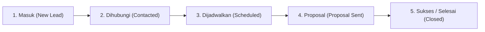

# 👔 Panduan Operasional CRM Admin — Inpartner Agent

Buku panduan ini disusun khusus untuk **Tim Business Development (BD), Tim Konsultan, dan Manajemen PT Inpartner Optima Integra** untuk mengelola prospek konsultasi yang masuk melalui Inpartner AI Assistant di website [inpartner.id](https://inpartner.id/).

---

## 🚪 1. Cara Mengakses Dasbor Admin

1. Buka peramban (*browser*) Anda dan akses alamat URL CRM:
   - **Lingkungan Produksi:** `https://chat.inpartner.id/admin`
   - **Lingkungan Lokal / Pengujian:** `http://localhost:3000/admin`
2. Masukkan kata sandi administratif (*Admin Password / PIN*) resmi perusahaan.
3. Klik tombol **"Masuk ke Dasbor CRM"**.

> [!NOTE]
> Sistem dilengkapi proteksi *Brute-Force Rate Limiting*. Jika salah memasukkan kata sandi sebanyak 5 kali berturut-turut, akses dari perangkat Anda akan dikunci sementara selama 15 menit demi keamanan data klien.

---

## 📊 2. Mengenal Papan Kanban Prospek (CRM Pipeline)

Setelah berhasil masuk, Anda akan melihat papan interaktif Kanban yang membagi prospek konsultasi ke dalam 5 tahapan alur kerja:

### Tahapan Status Prospek:
1. **Masuk (*New*):** Prospek baru saja mengisi formulir konsultasi di chatbot website dan belum ditindaklanjuti oleh tim BD.
2. **Dihubungi (*Contacted*):** Konsultan atau BD telah mengirimkan pesan pembuka via WhatsApp atau email resmi.
3. **Dijadwalkan (*Scheduled*):** Klien telah menyepakati jadwal sesi diskusi awal (*preliminary diagnostic meeting*) baik via tatap muka maupun online (Zoom / Google Meet).
4. **Proposal (*Proposal*):** Tim Inpartner telah mengirimkan *Term Sheet*, *Scope of Work (SoW)*, atau proposal konsultasi resmi.
5. **Sukses (*Closed / Converted*):** Klien resmi menandatangani *engagement letter* / kontrak layanan advisory.

### Mengubah Status & Menambah Catatan Konsultasi:
- Klik kartu prospek yang bersangkutan untuk membuka jendela detail.
- Pilih status baru pada menu dropdown.
- Tulis rangkuman diskusi pada kotak **"Catatan Konsultasi"** (misal: *"Klien membutuhkan valuasi bisnis untuk putaran pendanaan Seri A bulan depan"*).
- Klik **Simpan**.

---

## 🎯 3. Sistem Skoring Otomatis (Prioritas Prospek)

Setiap prospek yang masuk secara otomatis dinilai oleh sistem kecerdasan buatan dengan skor **0 hingga 100** berdasarkan potensi nilai komersialnya:

| Lencana (*Badge*) | Kategori | Skor | Tindakan Operasional yang Disarankan |
| :---: | :--- | :---: | :--- |
| 🔥 **Tier 1** | **Hot Opportunity** | **80 – 100** | **Prioritas Utama!** Segera hubungi pimpinan/klien dalam waktu **maksimal 1–2 jam**. Indikasi kebutuhan skala korporat besar (M&A, Restrukturisasi, Fundraising institusional). |
| ⚡ **Tier 2** | **Warm Lead** | **50 – 79** | **Prospek Strategis.** Hubungi pada hari kerja yang sama (maksimal 1x24 jam). Cocok untuk program ekspansi pasar atau optimasi profitabilitas. |
| 📋 **Tier 3** | **Standard Inquiry** | **< 50** | **Pertanyaan Umum.** Tindak lanjuti melalui pesan informasi standar atau undang ke jadwal konsultasi umum. |

---

## 📲 4. Menghubungi Klien via 1-Click WhatsApp

Untuk mempercepat respon tanpa perlu mengetik manual di ponsel:
1. Temukan kartu prospek yang ingin dihubungi.
2. Klik tombol hijau berikon WhatsApp (**"Chat WhatsApp"**).
3. Browser akan membuka WhatsApp Web / Aplikasi WhatsApp dengan teks pembuka resmi yang sudah terisi otomatis:
   > *"Halo Bapak/Ibu [Nama Klien], terima kasih telah berkonsultasi melalui Inpartner Agent di website inpartner.id (Ref: INP-20261005-XXXX). Kami dari tim Inpartner Optima Integra ingin menindaklanjuti kebutuhan konsultasi perusahaan Anda terkait [Kebutuhan Bisnis]..."*
4. Anda cukup menekan tombol kirim di WhatsApp.

---

## 📥 5. Mengekspor Data ke Excel & Google Sheets

Untuk pelaporan mingguan ke direksi atau analisis data offline:
1. Masuk ke tab **"Export Data"** atau klik tombol **"Export CSV"** di sudut kanan atas.
2. Anda dapat memfilter data berdasarkan:
   - Rentang tanggal (misal: 1 bulan terakhir).
   - Status tertentu (misal: hanya yang berstatus *Proposal*).
   - Tingkat prioritas (misal: hanya *Tier 1 Hot*).
3. Klik tombol **"Unduh CSV"**.
4. Berkas akan terunduh dengan format `inpartner-crm-leads-YYYY-MM-DD.csv`.

> [!TIP]
> **Keamanan Formula Excel (CWE-1236):**
> Seluruh teks pada file CSV hasil unduhan telah dibersihkan secara otomatis sehingga aman dibuka langsung di Microsoft Excel, Apple Numbers, maupun Google Sheets tanpa risiko eksekusi formula berbahaya.

---

## 📈 6. Meninjau Analitik & Tren Pengunjung

Klik tab **"Analytics"** untuk melihat performa interaksi website:
- **Total Percakapan:** Jumlah interaksi konsultasi digital yang terjadi.
- **Rasio Konversi (*Conversion Rate*):** Persentase pengunjung yang berhasil dikonversi menjadi prospek nyata yang meninggalkan kontak.
- **Pilar Layanan Paling Diminati:** Grafik distribusi topik yang paling sering ditanyakan:
  1. *Strategy & Corporate Advisory*
  2. *Investment & Project Advisory*
  3. *Market Access & Business Expansion*
  4. *Cross-Border & Technology Advisory*
  5. *Human Capital & Organization*

---

## 🔍 7. Menguji Jawaban AI (Knowledge Retrieval Tester)

Jika Inpartner meluncurkan program atau layanan baru dan Anda ingin memastikan apakah asisten AI sudah memahaminya:
1. Buka tab **"Knowledge Base"**.
2. Masukkan kata kunci atau pertanyaan pada kolom pencarian (misal: *"layanan feasibility study pabrik"*).
3. Klik **Cari**.
4. Sistem akan menampilkan berkas rujukan resmi (`knowledge/services/...`), skor relevansi, dan cuplikan teks yang akan digunakan oleh bot untuk menjawab calon klien.

---

## 📋 8. Standar Operasional Prosedur (SOP) Tindak Lanjut

1. **SLA Respon Hari Kerja (Senin–Jumat, 09:00–17:00 WIB):**
   - Prospek **Tier 1 Hot**: Maksimal 2 jam setelah notifikasi masuk.
   - Prospek **Tier 2 Warm**: Maksimal 6 jam pada hari yang sama.
2. **Prospek Akhir Pekan / Hari Libur:**
   - Dihubungi pada hari kerja berikutnya sebelum pukul 11:00 WIB.
3. **Kerahasiaan Data (NDA):**
   - Seluruh data nama perusahaan, nomor kontak, dan isu bisnis yang tersimpan pada dasbor CRM bersifat rahasia dan dilarang disebarluaskan ke pihak luar tanpa persetujuan tertulis manajemen Inpartner.
