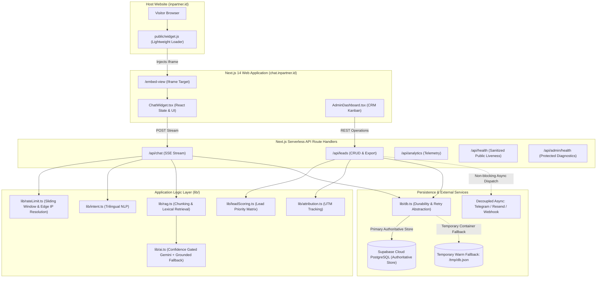
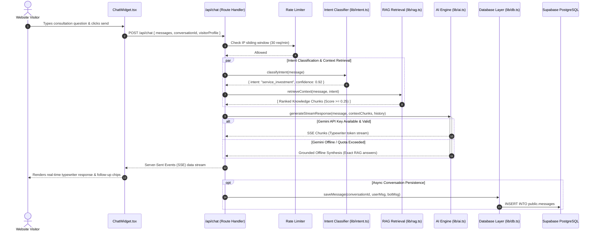
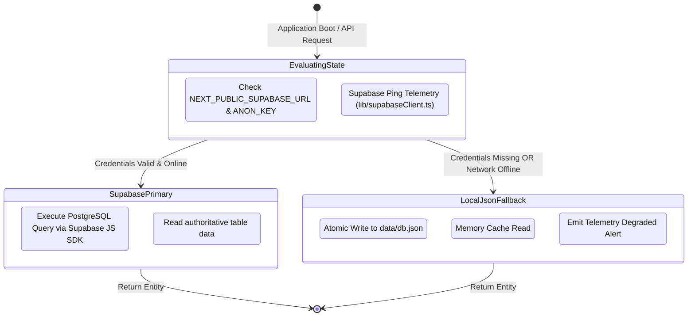
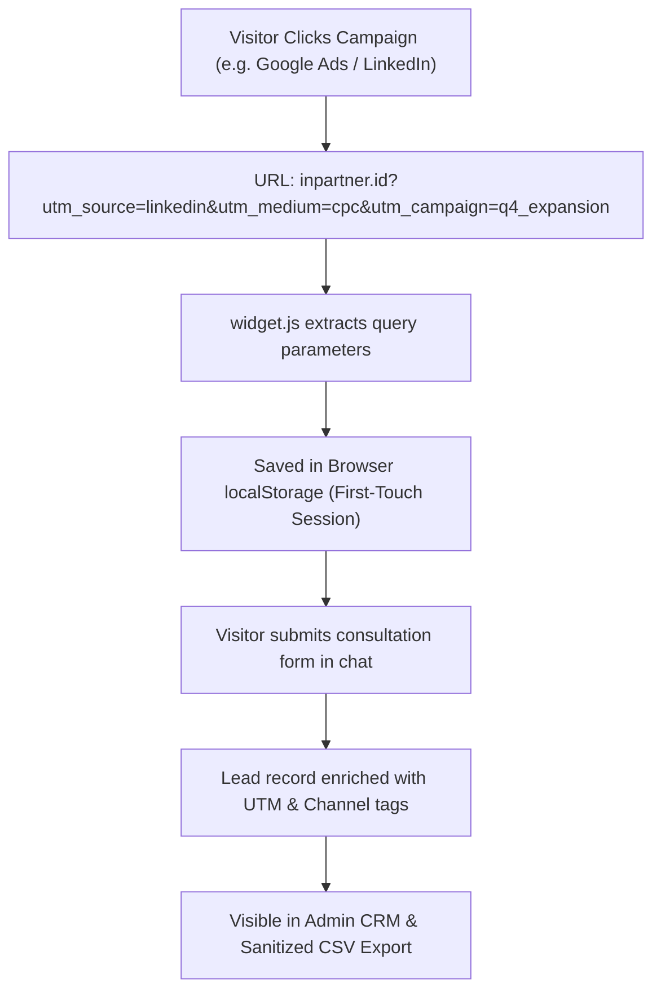

# 🏛️ Inpartner AI Assistant & CRM — System Architecture

This technical specification details the software engineering architecture, component boundaries, request lifecycles, and data synchronization workflows powering the **Inpartner AI Business Consultation Assistant & CRM**.

---

## 🧭 1. Architectural Vision & High-Level Topology

The system is designed with three core architectural tenets:
1. **Zero-Friction Host Integration:** The client widget runs asynchronously on any external website (`inpartner.id`, WordPress, Webflow, React) via a single lightweight script tag without modifying host infrastructure.
2. **Strictly Grounded RAG:** Conversational responses are restricted exclusively to official corporate knowledge bases, eliminating generative AI hallucinations.
3. **Dual-Mode Fail-Safe Data Layer:** An asynchronous abstraction layer guarantees uninterrupted uptime by automatically utilizing a local cache fallback if cloud database connectivity is disrupted.

---

## ⚡ 2. End-to-End Chat Request Lifecycle

The diagram below illustrates the sequence when a visitor submits an inquiry through the chat interface:

---

## 🧠 3. Grounded RAG (Retrieval-Augmented Generation) Pipeline

To avoid AI hallucinations common in general large language models, Inpartner Agent implements a strictly grounded pipeline:

```mermaid
flowchart LR
    subgraph Storage["Markdown Ground Truth (knowledge/)"]
        K1["company/company-profile.md"]
        K2["services/*.md (5 Pillars)"]
        K3["sectors/sectors.md (13 Sectors)"]
        K4["projects/projects.md (Case Studies)"]
        K5["contact/contact.md"]
        K6["faq/faq.md"]
    end

    subgraph Ingestion["Tokenizer & Chunking (lib/rag.ts)"]
        Parser["Header-based Chunk Splitter"]
        Tokenizer["Multilingual Tokenizer (ID, EN, KO)"]
    end

    subgraph QueryExecution["Real-Time Scoring Formula"]
        Scorer["Relevance Scorer: Title Weight (3.0x) + Keyword Match (1.0x)"]
        Filter["Threshold Filter (Score >= 0.25, Top 3 Chunks)"]
    end

    subgraph PromptBuilder["Context Assembly (lib/ai.ts)"]
        Guardrails["XML Delimitation (<context>, <visitor_query>)"]
        SystemPersona["Strict Corporate Advisor Persona"]
    end

    Storage --> Parser
    Parser --> Tokenizer
    Tokenizer --> Scorer
    Scorer --> Filter
    Filter --> Guardrails
    Guardrails --> SystemPersona
```

### RAG Scoring Mechanics:
1. **Document Ingestion:** Markdown files are split into granular semantic chunks bounded by Markdown level-2 and level-3 headers (`##`, `###`).
2. **Weighting Formula:**
   $$\text{Score} = (\text{TitleMatches} \times 3.0) + (\text{ContentMatches} \times 1.0) + \text{IntentBonus}(0.5)$$
3. **Thresholding:** Chunks with a score below `0.25` are pruned to ensure irrelevant corporate sections do not dilute the context window.
4. **Anti-Hallucination Directives:** If no relevant chunk matches, the engine responds with a graceful consultative disclaimer and provides direct contact avenues (WhatsApp / Email).

---

## 🗄️ 4. Dual-Mode Fail-Safe Database Architecture

The data access layer (`lib/db.ts`) provides high-availability guarantees through an automated fail-safe switch:

### Key Guarantees:
- **Zero Interruption:** The chat widget never throws a `500 Internal Server Error` to visitors due to database outages; conversations continue seamlessly in fallback mode.
- **Prefix-Identified Keys:** Entity IDs use cryptographically randomized prefix identifiers (`lead_1728100...`, `conv_...`, `msg_...`, `evt_...`) ensuring no primary key collisions when synchronizing between local and cloud databases.

---

## 🎯 5. Lead Prioritization Matrix & Scoring Algorithm

Every captured sales lead is evaluated automatically through a multi-factor commercial prioritization matrix (`lib/scoring.ts`):

| Evaluation Factor | Logic / Condition | Weight Points |
| :--- | :--- | :---: |
| **High-Value Advisory Scope** | M&A, Restructuring, Capital Raising, Cross-Border JV | +30 pts |
| **Corporate Domain Email** | Non-generic email domain (not `@gmail.com`, `@yahoo.com`, etc.) | +25 pts |
| **Enterprise Employee Scale** | Scale > 50 employees | +20 pts |
| **Annual Revenue Tier** | Revenue > IDR 10 Milyar or USD 1M+ | +15 pts |
| **Complete Qualification Data** | Full submission (Name + Company + Phone + Scope) | +10 pts |

### Commercial Priority Tiers:
- 🔥 **Tier 1 (Hot Opportunity):** Score **80 – 100**. Immediate partner-level notification dispatched; priority 1-hour response SLA.
- ⚡ **Tier 2 (Warm / Strategic Lead):** Score **50 – 79**. Senior consultant assigned; same-day business outreach.
- 📋 **Tier 3 (Standard Inquiry):** Score **< 50**. Nurtured through consultative email or standard scheduling link.

---

## 🌐 6. Marketing Attribution Pipeline

When a visitor clicks into `inpartner.id` from marketing campaigns, the assistant preserves first-touch attribution (`lib/attribution.ts`):

---

## 🔒 7. Security Boundaries & Threat Modeling

1. **Host Iframe Sandboxing:** The embed script isolates the consultation viewport using `iframe` containers with controlled permissions.
2. **CSP Header Defense:** Production reverse proxies enforce `frame-ancestors https://inpartner.id https://*.inpartner.id;` preventing unauthorized clickjacking embeddings.
3. **CWE-1236 Defense:** CSV lead exports prepend `'` to formula triggers (`=`, `+`, `-`, `@`), preventing formula execution when opened in spreadsheet software.
4. **Timing-Safe Auth:** Admin login uses crypto-grade timing-safe string comparison to prevent timing-attack vulnerability vectors.
