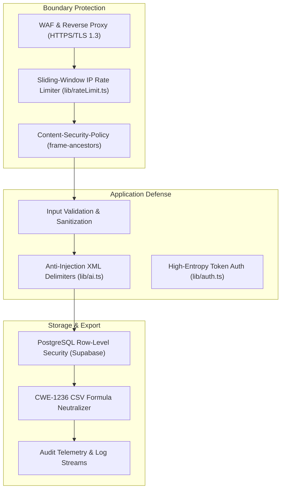

# 🛡️ Security Policy & Data Protection Architecture

PT Inpartner Optima Integra is committed to maintaining the confidentiality, integrity, and availability of our corporate advisory systems, enterprise client consultation inquiries, and underlying infrastructure.

This document details the security architecture, data governance principles, and vulnerability reporting procedures for the **Inpartner AI Business Consultation Assistant & CRM**.

---

## 📌 1. Supported Versions

Security updates, patches, and hotfixes are actively maintained for the following versions:

| Version | Supported | Security Maintenance Status |
| :--- | :---: | :--- |
| `1.0.x` (Current Main) | ✅ Yes | Active production support & priority patch releases |
| `< 1.0.0` (Development/Beta) | ❌ No | Deprecated; upgrade immediately to `1.0.0+` |

---

## 🚨 2. Reporting a Vulnerability

We value the security community and prioritize responsible disclosure. If you discover a potential vulnerability or security weakness in Inpartner Agent:

### Reporting Protocol:
1. **Private Channel:** Do **NOT** file public GitHub issues or disclose vulnerabilities publicly before a fix is published.
2. **Email Disclosure:** Send your encrypted or signed report directly to:
   - **Corporate Security:** `corporatesecretary@inpartner.id`
   - **Technical Desk:** `info@inpartner.id`
3. **Include the Following Details:**
   - Affected endpoint, component, or URL (e.g., `/api/leads`, `/api/chat`, or `widget.js`).
   - Step-by-step reproduction instructions or Proof of Concept (PoC).
   - Potential impact assessment (e.g., unauthorized data disclosure, bypass of rate limits, RAG manipulation).
   - Your name or handle for security acknowledgment (if desired).

### Service Level Agreement (SLA):
- **Initial Acknowledgment:** Within 24 hours of receipt.
- **Triage & Severity Assessment:** Within 48 hours.
- **Remediation & Patch Deployment:** Critical vulnerabilities are addressed within 72 hours; non-critical issues within 7 business days.

---

## 🔒 3. Built-in Security & Defense Architecture

The Inpartner Agent incorporates defense-in-depth mechanisms across all layers:

### A. Anti-Hallucination & Prompt Injection Guardrails
- **Strict Knowledge Grounding:** All AI responses are anchored exclusively in verified markdown files stored in [`knowledge/`](./knowledge/).
- **XML Tag Delimitation:** Visitor queries are isolated within `<visitor_query>` and `<context>` XML boundaries to prevent conversational jailbreaking or system prompt override attacks.
- **Corporate Boundary Directives:** The system explicitly refrains from answering political, speculative, religious, or non-corporate advisory topics, gracefully redirecting visitors to official advisory pillars.

### B. CWE-1236 Spreadsheet Formula Injection Defense
- Prospek consultation data exported to CSV (`/api/admin/export`) is sanitized to neutralize malicious command execution in Microsoft Excel and Google Sheets.
- Cell values starting with dangerous formula characters (`=`, `+`, `-`, `@`, `\t`, `\r`) are automatically prepended with a single quote (`'`), ensuring they render purely as harmless textual data.

### C. Distributed Fixed-Window & Edge Rate Limiting
- Built-in fixed-window rate limiter with TTL protects public entry points from denial-of-service (DoS) and brute-force attacks:
  - `/api/chat`: Max 30 requests per IP per minute.
  - `/api/leads`: Max 5 submissions per IP per 10 minutes.
  - `/api/admin/login`: Max 5 authentication attempts per IP per 15 minutes.
  - `/api/analytics`: Max 60 events per IP per minute with strict event name allowlist and 4KB metadata size bounding.
- Client IP resolution resolves edge proxy headers (`CF-Connecting-IP`, `True-Client-IP`, `X-Real-IP`, sanitized `X-Forwarded-For`).
- Distributed rate limiting via Upstash Redis REST (`UPSTASH_REDIS_REST_URL` & `UPSTASH_REDIS_REST_TOKEN`) ensures synchronized quota enforcement across multi-instance serverless deployments with automatic local fallback.

### D. Session & Authentication Security
- **Admin CRM Access:** Protected by signed cryptographic session tokens (`AUTH_SECRET`).
- **PostgreSQL Server-Side Session Tracking:** Sessions are persisted in the `admin_sessions` Supabase table upon login (`sessionId.timestamp.signature`); on `/api/admin/logout`, session tokens are marked revoked in the database and local memory cache, instantly invalidating them across all runtime instances.
- **Timing-Safe Evaluation:** Password comparison employs timing-safe string matching algorithms (`crypto.timingSafeEqual`) to resist timing-attack side channels.
- **Secure Cookie Flags:** Admin session cookies are configured with `HttpOnly`, `SameSite=Lax`, and `Secure` (in production).

### E. Database Security & Row-Level Security (RLS)
- Supabase PostgreSQL tables (`leads`, `conversations`, `messages`, `analytics_events`, `admin_sessions`) have Row-Level Security (RLS) enabled and forced (`FORCE ROW LEVEL SECURITY`).
- All direct Data API mutations and reads from the public anonymous role (`anon`) are revoked.
- The Next.js server-side API Gateway acts as the trusted mediator via `SUPABASE_SERVICE_ROLE_KEY`, performing strict input validation, attribution sanitization, and business logic before persistence.
- Public `/api/health` returns only minimal status without disclosing database URLs or AI model internals.
- All API 500 errors are sanitized with a generic message and correlated `request_id` to eliminate error message leaks.

---

## 🇮🇩 4. Compliance with Indonesian Data Protection Law (UU PDP)

The application complies with **Undang-Undang Republik Indonesia Nomor 27 Tahun 2022 tentang Perlindungan Data Pribadi (UU PDP)**:

1. **Prinsip Persetujuan Eksplisit (*Explicit Consent*):** Setiap pengiriman data prospek pada formulir konsultasi mewajibkan persetujuan aktif (*opt-in checkbox*) atas kebijakan privasi Inpartner.
2. **Minimisasi Data (*Data Minimization*):** Hanya data yang relevan untuk kebutuhan konsultasi bisnis (Nama, Perusahaan, Email, No. WhatsApp, Tantangan Bisnis) yang dikumpulkan.
3. **Enkripsi dalam Transit & At Rest:** Seluruh lalu lintas data dienkripsi menggunakan protokol TLS 1.3, dan data pada Supabase dienkripsi menggunakan AES-256 pada tingkat penyimpanan.
4. **Hak Subjek Data:** Prospek atau klien dapat meminta penghapusan (*data erasure*) atau perbaikan data melalui email resmi `corporatesecretary@inpartner.id`.

---

## 📋 5. Security Checklist for Production Deployments

Before launching into production, verify:
- [ ] `ADMIN_PASSWORD` is changed from defaults to a strong, high-entropy password (minimum 16 characters).
- [ ] `AUTH_SECRET` is generated via a cryptographically secure random generator (e.g. `openssl rand -hex 32`).
- [ ] `SUPABASE_SERVICE_ROLE_KEY` is configured in the backend environment and never exposed with `NEXT_PUBLIC_`.
- [ ] `NEXT_PUBLIC_SUPABASE_URL` points to the official production Supabase instance.
- [ ] Direct anon access on Supabase Data API is restricted via `supabase/schema.sql`.
- [ ] HTTPS enforcement is active across both root domain and subdomains.
- [ ] Custom CSP headers restrict `frame-ancestors` exclusively to `https://inpartner.id` and authorized subdomains.
